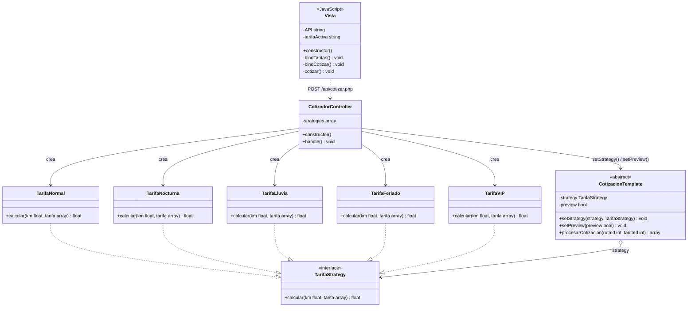
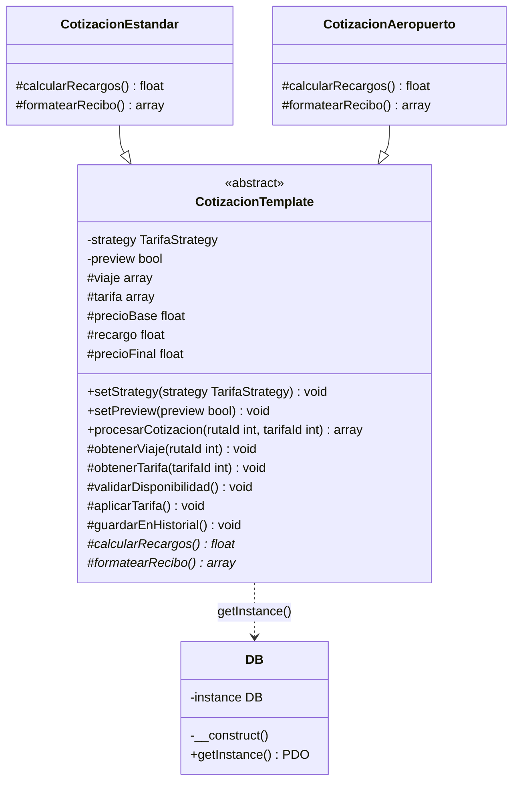
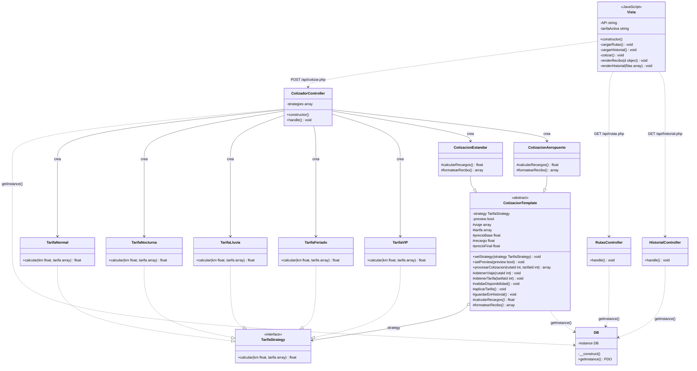

# Diagramas UML

---

## Archivos → clases UML

| Archivo | Clase UML | Tipo | Lenguaje |
|---|---|---|---|
| `app.js` | `Vista` | clase | JavaScript |
| `api/cotizar.php` | `CotizadorController` | clase | PHP |
| `api/rutas.php` | `RutasController` | clase | PHP |
| `api/historial.php` | `HistorialController` | clase | PHP |
| `src/DB.php` | `DB` | clase (Singleton) | PHP |
| `src/Strategy/TarifaStrategy.php` | `TarifaStrategy` | `<<interface>>` | PHP |
| `src/Strategy/TarifaNormal.php` | `TarifaNormal` | clase concreta | PHP |
| `src/Strategy/TarifaNocturna.php` | `TarifaNocturna` | clase concreta | PHP |
| `src/Strategy/TarifaLluvia.php` | `TarifaLluvia` | clase concreta | PHP |
| `src/Strategy/TarifaFeriado.php` | `TarifaFeriado` | clase concreta | PHP |
| `src/Strategy/TarifaVIP.php` | `TarifaVIP` | clase concreta | PHP |
| `src/Template/CotizacionTemplate.php` | `CotizacionTemplate` | `<<abstract>>` — Context + AbstractClass | PHP |
| `src/Template/CotizacionEstandar.php` | `CotizacionEstandar` | clase concreta | PHP |
| `src/Template/CotizacionAeropuerto.php` | `CotizacionAeropuerto` | clase concreta | PHP |

---

## Diagrama 1 — Strategy Pattern

---

## Diagrama 2 — Template Method Pattern

---

## Diagrama 3 — Sistema completo

